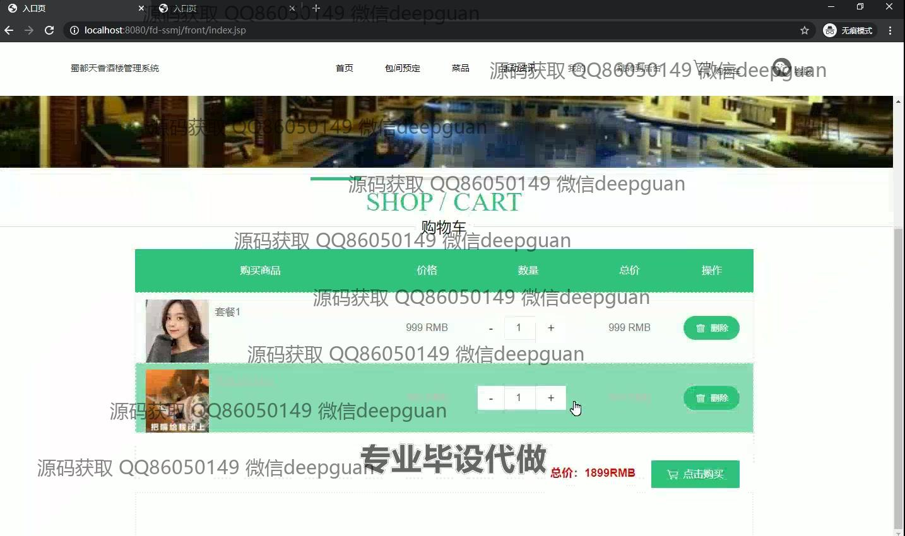

<h1 align="center">蜀都天香酒楼的网站设计与实现</h1>

## 简介
蜀都天香酒楼管理系统：角色分为管理员、用户；包含用户管理、菜品管理、包间管理、订单和评论管理，以及在线预订、购物车和评价功能，设计注重用户体验和视觉美感。    --计算机毕业设计源码；毕设源码；java毕业设计源码

## 联系方式

<h3 align="center">获取完整代码与数据库文件 + 微信：deepguan QQ: 86050149 QQ群: 783742310</h3>

<h3 align="center">可帮忙远程部署 包运行成功！提供远程部署、修改代码、设计文档指导、代码讲解等服务！</h3>

## 功能介绍（完整见运行截图）
管理员：基本功能包括登录、注册和退出。提供复杂数据管理功能，如用户、类型、菜品、包间、订单管理。主导航栏具有首页、菜品、包间预定、活动资讯等选项。后台管理可进行菜品信息录入与修改，设置轮播图和上传图片。支持用户批量管理及数据查询功能，确保方便后台操作。订单管理界面允许查看订单详情和进行退货操作。个人中心使管理员可以查看和编辑账户信息，既确保数据安全，也支持高效管理。

用户：基本功能包含登录、注册和退出。网站首页设计典雅，整合导航栏、餐厅介绍、菜品展示、预订功能与联系方式。用户可通过首页获取餐厅信息，如特色菜品与文化氛围。菜品部分提供查看商品图片与价格、完善的在线订购功能。预订模块支持用户选择日期、时间及人数，提高用餐便捷度。个人中心可查看、编辑个人信息、账号和订单，且支持快速充值。通过简约界面，用户能迅速访问订单或收藏信息，实现卓越的用户体验。

## 运行截图

本代码来源于网络,仅供学习参考使用!

